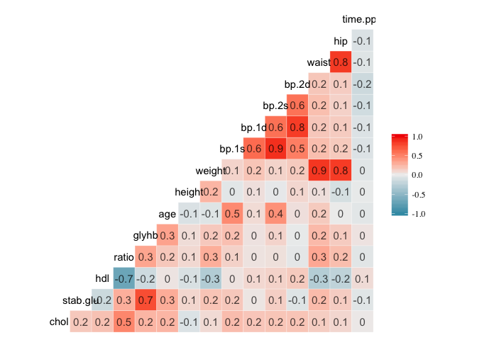
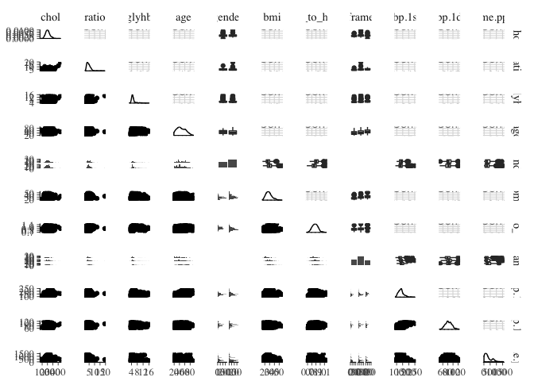
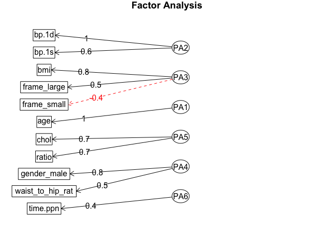
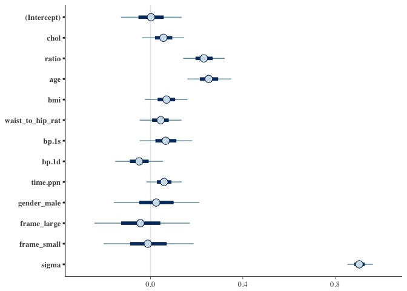
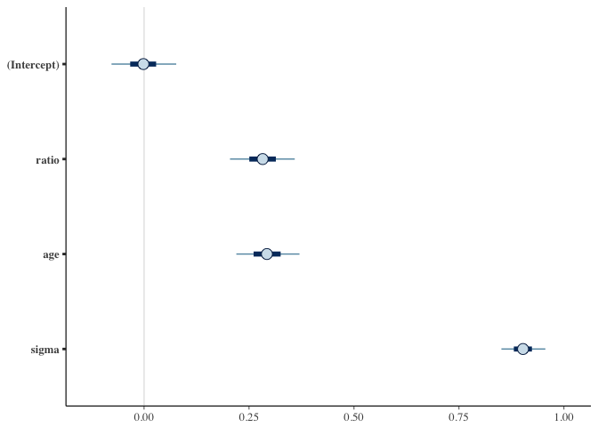
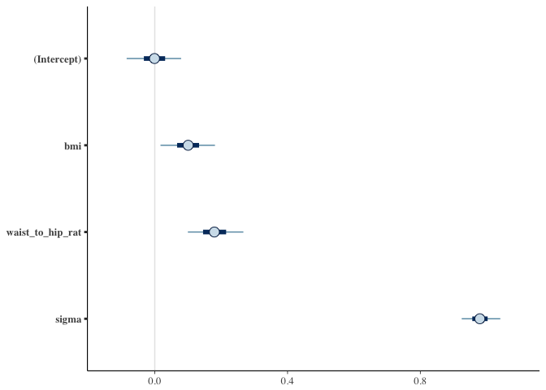
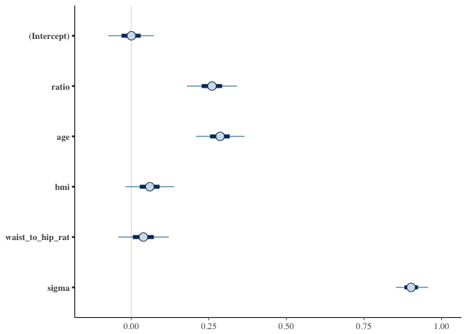
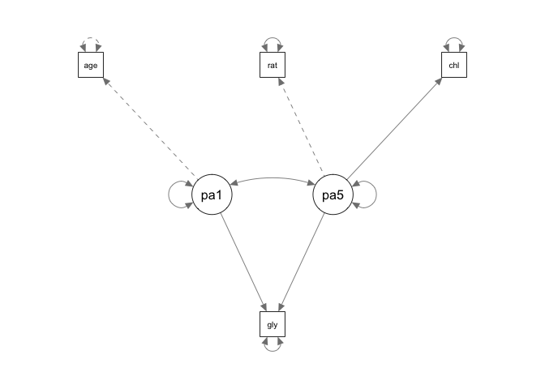

Case Study 1 - Diabetes dataset
================
Murat Koptur
26 Ağustos 2018

``` r
library(dplyr)
```

    ## 
    ## Attaching package: 'dplyr'

    ## The following objects are masked from 'package:stats':
    ## 
    ##     filter, lag

    ## The following objects are masked from 'package:base':
    ## 
    ##     intersect, setdiff, setequal, union

``` r
library(fastDummies)
library(GGally)
```

    ## Loading required package: ggplot2

    ## 
    ## Attaching package: 'GGally'

    ## The following object is masked from 'package:dplyr':
    ## 
    ##     nasa

``` r
library(lavaan)
```

    ## This is lavaan 0.6-2

    ## lavaan is BETA software! Please report any bugs.

``` r
library(magrittr)
library(mice)
```

    ## Loading required package: lattice

    ## 
    ## Attaching package: 'mice'

    ## The following objects are masked from 'package:base':
    ## 
    ##     cbind, rbind

``` r
library(psych)
```

    ## 
    ## Attaching package: 'psych'

    ## The following object is masked from 'package:lavaan':
    ## 
    ##     cor2cov

    ## The following objects are masked from 'package:ggplot2':
    ## 
    ##     %+%, alpha

``` r
library(semPlot)
```

``` r
# http://biostat.mc.vanderbilt.edu/wiki/Main/DataSets
load("./data/diabetes.sav")
```

``` r
str(diabetes)
```

    ## 'data.frame':    403 obs. of  19 variables:
    ##  $ id      : 'labelled' int  1000 1001 1002 1003 1005 1008 1011 1015 1016 1022 ...
    ##   ..- attr(*, "label")= chr "Subject ID"
    ##  $ chol    : 'labelled' int  203 165 228 78 249 248 195 227 177 263 ...
    ##   ..- attr(*, "label")= chr "Total Cholesterol"
    ##  $ stab.glu: 'labelled' int  82 97 92 93 90 94 92 75 87 89 ...
    ##   ..- attr(*, "label")= chr "Stabilized Glucose"
    ##  $ hdl     : 'labelled' int  56 24 37 12 28 69 41 44 49 40 ...
    ##   ..- attr(*, "label")= chr "High Density Lipoprotein"
    ##  $ ratio   : 'labelled' num  3.6 6.9 6.2 6.5 8.9 ...
    ##   ..- attr(*, "label")= chr "Cholesterol/HDL Ratio"
    ##  $ glyhb   : 'labelled' num  4.31 4.44 4.64 4.63 7.72 ...
    ##   ..- attr(*, "label")= chr "Glycosolated Hemoglobin"
    ##  $ location: Factor w/ 2 levels "Buckingham","Louisa": 1 1 1 1 1 1 1 1 1 1 ...
    ##  $ age     : int  46 29 58 67 64 34 30 37 45 55 ...
    ##   ..- attr(*, "units")= chr "years"
    ##  $ gender  : Factor w/ 2 levels "male","female": 2 2 2 1 1 1 1 1 1 2 ...
    ##  $ height  : int  62 64 61 67 68 71 69 59 69 63 ...
    ##   ..- attr(*, "units")= chr "inches"
    ##  $ weight  : int  121 218 256 119 183 190 191 170 166 202 ...
    ##   ..- attr(*, "units")= chr "pounds"
    ##  $ frame   : Factor w/ 3 levels "small","medium",..: 2 3 3 3 2 3 2 2 3 1 ...
    ##  $ bp.1s   : 'labelled' int  118 112 190 110 138 132 161 NA 160 108 ...
    ##   ..- attr(*, "label")= chr "First Systolic Blood Pressure"
    ##  $ bp.1d   : 'labelled' int  59 68 92 50 80 86 112 NA 80 72 ...
    ##   ..- attr(*, "label")= chr "First Diastolic Blood Pressure"
    ##  $ bp.2s   : 'labelled' int  NA NA 185 NA NA NA 161 NA 128 NA ...
    ##   ..- attr(*, "label")= chr "Second Systolic Blood Pressure"
    ##   ..- attr(*, "comment")= chr "equals first measurement if it was not high"
    ##  $ bp.2d   : 'labelled' int  NA NA 92 NA NA NA 112 NA 86 NA ...
    ##   ..- attr(*, "comment")= chr "equals first measurement if it was not high"
    ##   ..- attr(*, "label")= chr "Second Diastolic Blood Pressure"
    ##  $ waist   : int  29 46 49 33 44 36 46 34 34 45 ...
    ##   ..- attr(*, "units")= chr "inches"
    ##  $ hip     : int  38 48 57 38 41 42 49 39 40 50 ...
    ##   ..- attr(*, "units")= chr "inches"
    ##  $ time.ppn: 'labelled' int  720 360 180 480 300 195 720 1020 300 240 ...
    ##   ..- attr(*, "label")= chr "Postprandial Time when Labs were Drawn"
    ##   ..- attr(*, "units")= chr "minutes"

``` r
# I'll not use location in this analysis
diabetes <- select(diabetes, -location, -id)
```

``` r
# Let's look at summary of data
summary(diabetes)
```

    ##       chol          stab.glu          hdl             ratio       
    ##  Min.   : 78.0   Min.   : 48.0   Min.   : 12.00   Min.   : 1.500  
    ##  1st Qu.:179.0   1st Qu.: 81.0   1st Qu.: 38.00   1st Qu.: 3.200  
    ##  Median :204.0   Median : 89.0   Median : 46.00   Median : 4.200  
    ##  Mean   :207.8   Mean   :106.7   Mean   : 50.45   Mean   : 4.522  
    ##  3rd Qu.:230.0   3rd Qu.:106.0   3rd Qu.: 59.00   3rd Qu.: 5.400  
    ##  Max.   :443.0   Max.   :385.0   Max.   :120.00   Max.   :19.300  
    ##  NA's   :1                       NA's   :1        NA's   :1       
    ##      glyhb            age           gender        height     
    ##  Min.   : 2.68   Min.   :19.00   male  :169   Min.   :52.00  
    ##  1st Qu.: 4.38   1st Qu.:34.00   female:234   1st Qu.:63.00  
    ##  Median : 4.84   Median :45.00                Median :66.00  
    ##  Mean   : 5.59   Mean   :46.85                Mean   :66.02  
    ##  3rd Qu.: 5.60   3rd Qu.:60.00                3rd Qu.:69.00  
    ##  Max.   :16.11   Max.   :92.00                Max.   :76.00  
    ##  NA's   :13                                   NA's   :5      
    ##      weight         frame         bp.1s           bp.1d       
    ##  Min.   : 99.0   small :104   Min.   : 90.0   Min.   : 48.00  
    ##  1st Qu.:151.0   medium:184   1st Qu.:121.2   1st Qu.: 75.00  
    ##  Median :172.5   large :103   Median :136.0   Median : 82.00  
    ##  Mean   :177.6   NA's  : 12   Mean   :136.9   Mean   : 83.32  
    ##  3rd Qu.:200.0                3rd Qu.:146.8   3rd Qu.: 90.00  
    ##  Max.   :325.0                Max.   :250.0   Max.   :124.00  
    ##  NA's   :1                    NA's   :5       NA's   :5       
    ##      bp.2s           bp.2d            waist           hip       
    ##  Min.   :110.0   Min.   : 60.00   Min.   :26.0   Min.   :30.00  
    ##  1st Qu.:138.0   1st Qu.: 84.00   1st Qu.:33.0   1st Qu.:39.00  
    ##  Median :149.0   Median : 92.00   Median :37.0   Median :42.00  
    ##  Mean   :152.4   Mean   : 92.52   Mean   :37.9   Mean   :43.04  
    ##  3rd Qu.:161.0   3rd Qu.:100.00   3rd Qu.:41.0   3rd Qu.:46.00  
    ##  Max.   :238.0   Max.   :124.00   Max.   :56.0   Max.   :64.00  
    ##  NA's   :262     NA's   :262      NA's   :2      NA's   :2      
    ##     time.ppn     
    ##  Min.   :   5.0  
    ##  1st Qu.:  90.0  
    ##  Median : 240.0  
    ##  Mean   : 341.2  
    ##  3rd Qu.: 517.5  
    ##  Max.   :1560.0  
    ##  NA's   :3

``` r
# Investigate NA counts
colSums(is.na(diabetes))
```

    ##     chol stab.glu      hdl    ratio    glyhb      age   gender   height 
    ##        1        0        1        1       13        0        0        5 
    ##   weight    frame    bp.1s    bp.1d    bp.2s    bp.2d    waist      hip 
    ##        1       12        5        5      262      262        2        2 
    ## time.ppn 
    ##        3

``` r
# bp.2s and bp.2d variables has too much missing values

# Glycosolated hemoglobin (glyhb) column has 13 NAs
# I'll drop these observations
diabetes <- filter(diabetes, !is.na(glyhb))
```

``` r
# impute 
md.pattern(diabetes)
```


    ##     stab.glu glyhb age gender chol hdl ratio weight waist hip time.ppn
    ## 130        1     1   1      1    1   1     1      1     1   1        1
    ## 236        1     1   1      1    1   1     1      1     1   1        1
    ## 6          1     1   1      1    1   1     1      1     1   1        1
    ## 3          1     1   1      1    1   1     1      1     1   1        1
    ## 3          1     1   1      1    1   1     1      1     1   1        1
    ## 4          1     1   1      1    1   1     1      1     1   1        1
    ## 1          1     1   1      1    1   1     1      1     1   1        1
    ## 1          1     1   1      1    1   1     1      1     1   1        0
    ## 1          1     1   1      1    1   1     1      1     1   1        0
    ## 1          1     1   1      1    1   1     1      1     1   1        0
    ## 1          1     1   1      1    1   1     1      1     0   0        1
    ## 1          1     1   1      1    1   1     1      1     0   0        1
    ## 1          1     1   1      1    1   1     1      0     1   1        1
    ## 1          1     1   1      1    0   0     0      1     1   1        1
    ##            0     0   0      0    1   1     1      1     2   2        3
    ##     height bp.1s bp.1d frame bp.2s bp.2d    
    ## 130      1     1     1     1     1     1   0
    ## 236      1     1     1     1     0     0   2
    ## 6        1     1     1     0     1     1   1
    ## 3        1     1     1     0     0     0   3
    ## 3        1     0     0     1     0     0   4
    ## 4        0     1     1     1     0     0   3
    ## 1        0     0     0     0     0     0   6
    ## 1        1     1     1     1     1     1   1
    ## 1        1     1     1     0     0     0   4
    ## 1        1     0     0     1     0     0   5
    ## 1        1     1     1     1     1     1   2
    ## 1        1     1     1     1     0     0   4
    ## 1        1     1     1     1     0     0   3
    ## 1        1     1     1     1     0     0   5
    ##          5     5     5    11   252   252 541

``` r
diabetes_imp <-
  mice(
    data = diabetes,
    m = 5,
    maxit = 50,
    method = "pmm"
  )
```

``` r
# Take first imputed dataset (we have 5 imputed datasets, m=5)
diabetes_completed <- complete(diabetes_imp, 1)
```

    ## Warning in bind_rows_(x, .id): Vectorizing 'labelled' elements may not
    ## preserve their attributes

    ## Warning in bind_rows_(x, .id): Vectorizing 'labelled' elements may not
    ## preserve their attributes

    ## Warning in bind_rows_(x, .id): Vectorizing 'labelled' elements may not
    ## preserve their attributes

    ## Warning in bind_rows_(x, .id): Vectorizing 'labelled' elements may not
    ## preserve their attributes

    ## Warning in bind_rows_(x, .id): Vectorizing 'labelled' elements may not
    ## preserve their attributes

    ## Warning in bind_rows_(x, .id): Vectorizing 'labelled' elements may not
    ## preserve their attributes

    ## Warning in bind_rows_(x, .id): Vectorizing 'labelled' elements may not
    ## preserve their attributes

    ## Warning in bind_rows_(x, .id): Vectorizing 'labelled' elements may not
    ## preserve their attributes

    ## Warning in bind_rows_(x, .id): Vectorizing 'labelled' elements may not
    ## preserve their attributes

    ## Warning in bind_rows_(x, .id): Vectorizing 'labelled' elements may not
    ## preserve their attributes

``` r
# Investigate NA counts again
colSums(is.na(diabetes_completed))
```

    ##     chol stab.glu      hdl    ratio    glyhb      age   gender   height 
    ##        0        0        0        0        0        0        0        0 
    ##   weight    frame    bp.1s    bp.1d    bp.2s    bp.2d    waist      hip 
    ##        0        0        0        0        0        0        0        0 
    ## time.ppn 
    ##        0

``` r
# correlation analysis
ggcorr(diabetes_completed, label = TRUE, label_alpha = .7)
```

    ## Warning in ggcorr(diabetes_completed, label = TRUE, label_alpha = 0.7):
    ## data in column(s) 'gender', 'frame' are not numeric and were ignored



``` r
corr_table <-
  cor(diabetes_completed[, sapply(diabetes_completed, is.numeric)])
subset(as.data.frame(as.table(corr_table)), abs(Freq) > 0.5)
```

    ##         Var1     Var2       Freq
    ## 1       chol     chol  1.0000000
    ## 17  stab.glu stab.glu  1.0000000
    ## 20     glyhb stab.glu  0.7492355
    ## 33       hdl      hdl  1.0000000
    ## 34     ratio      hdl -0.6814209
    ## 48       hdl    ratio -0.6814209
    ## 49     ratio    ratio  1.0000000
    ## 62  stab.glu    glyhb  0.7492355
    ## 65     glyhb    glyhb  1.0000000
    ## 81       age      age  1.0000000
    ## 97    height   height  1.0000000
    ## 113   weight   weight  1.0000000
    ## 118    waist   weight  0.8515395
    ## 119      hip   weight  0.8291652
    ## 129    bp.1s    bp.1s  1.0000000
    ## 130    bp.1d    bp.1s  0.6014482
    ## 131    bp.2s    bp.1s  0.8821727
    ## 132    bp.2d    bp.1s  0.5271511
    ## 144    bp.1s    bp.1d  0.6014482
    ## 145    bp.1d    bp.1d  1.0000000
    ## 146    bp.2s    bp.1d  0.5633463
    ## 147    bp.2d    bp.1d  0.7987004
    ## 159    bp.1s    bp.2s  0.8821727
    ## 160    bp.1d    bp.2s  0.5633463
    ## 161    bp.2s    bp.2s  1.0000000
    ## 162    bp.2d    bp.2s  0.5876688
    ## 174    bp.1s    bp.2d  0.5271511
    ## 175    bp.1d    bp.2d  0.7987004
    ## 176    bp.2s    bp.2d  0.5876688
    ## 177    bp.2d    bp.2d  1.0000000
    ## 188   weight    waist  0.8515395
    ## 193    waist    waist  1.0000000
    ## 194      hip    waist  0.8347156
    ## 203   weight      hip  0.8291652
    ## 208    waist      hip  0.8347156
    ## 209      hip      hip  1.0000000
    ## 225 time.ppn time.ppn  1.0000000

``` r
# since bp.2d and bp.2s seems highly correlated with bp.1d and bp.1s and 
# they have a lot of missing values, I decided to discard them from analysis 

# also, I'll create two new variables,
# BMI (body mass index) and waist-to-hip ratio

diabetes_completed$bmi <-
  (diabetes_completed$weight / (diabetes_completed$height ** 2) * 703)
diabetes_completed$waist_to_hip_rat <-
  diabetes_completed$waist / diabetes_completed$hip

# take a subset of uncorrelated variables
diabetes_completed_subset <- select(
  diabetes_completed,
  chol,
  ratio,
  glyhb,
  age,
  gender,
  bmi,
  waist_to_hip_rat,
  frame,
  bp.1s,
  bp.1d,
  time.ppn
)
head(diabetes_completed_subset)
```

    ##   chol ratio glyhb age gender      bmi waist_to_hip_rat  frame bp.1s bp.1d
    ## 1  203   3.6  4.31  46 female 22.12877        0.7631579 medium   118    59
    ## 2  165   6.9  4.44  29 female 37.41553        0.9583333  large   112    68
    ## 3  228   6.2  4.64  58 female 48.36549        0.8596491  large   190    92
    ## 4   78   6.5  4.63  67   male 18.63600        0.8684211  large   110    50
    ## 5  249   8.9  7.72  64   male 27.82202        1.0731707 medium   138    80
    ## 6  248   3.6  4.81  34   male 26.49673        0.8571429  large   132    86
    ##   time.ppn
    ## 1      720
    ## 2      360
    ## 3      180
    ## 4      480
    ## 5      300
    ## 6      195

``` r
# pairs plot
ggpairs(diabetes_completed_subset)
```

    ## `stat_bin()` using `bins = 30`. Pick better value with `binwidth`.
    ## `stat_bin()` using `bins = 30`. Pick better value with `binwidth`.
    ## `stat_bin()` using `bins = 30`. Pick better value with `binwidth`.
    ## `stat_bin()` using `bins = 30`. Pick better value with `binwidth`.
    ## `stat_bin()` using `bins = 30`. Pick better value with `binwidth`.
    ## `stat_bin()` using `bins = 30`. Pick better value with `binwidth`.
    ## `stat_bin()` using `bins = 30`. Pick better value with `binwidth`.
    ## `stat_bin()` using `bins = 30`. Pick better value with `binwidth`.
    ## `stat_bin()` using `bins = 30`. Pick better value with `binwidth`.
    ## `stat_bin()` using `bins = 30`. Pick better value with `binwidth`.
    ## `stat_bin()` using `bins = 30`. Pick better value with `binwidth`.
    ## `stat_bin()` using `bins = 30`. Pick better value with `binwidth`.
    ## `stat_bin()` using `bins = 30`. Pick better value with `binwidth`.
    ## `stat_bin()` using `bins = 30`. Pick better value with `binwidth`.
    ## `stat_bin()` using `bins = 30`. Pick better value with `binwidth`.
    ## `stat_bin()` using `bins = 30`. Pick better value with `binwidth`.
    ## `stat_bin()` using `bins = 30`. Pick better value with `binwidth`.
    ## `stat_bin()` using `bins = 30`. Pick better value with `binwidth`.



``` r
# standardize all variables
diabetes_completed_subset %<>%
  mutate_at(
    funs(scale),
    .vars = c(
      "chol",
      "ratio",
      "glyhb",
      "age",
      "bmi",
      "waist_to_hip_rat",
      "bp.1s",
      "bp.1d",
      "time.ppn"
    )
  )
```

``` r
# Create dummy variables for gender and frame
library(fastDummies)
diabetes_completed_subset <-
  dummy_cols(diabetes_completed_subset, remove_first_dummy = TRUE)
diabetes_completed_subset <-
  select(diabetes_completed_subset,-gender,-frame)
head(diabetes_completed_subset)
```

    ##         chol      ratio      glyhb         age        bmi waist_to_hip_rat
    ## 1 -0.0920546 -0.5303890 -0.5706645 -0.04711384 -1.0001203       -1.6088057
    ## 2 -0.9409962  1.3678608 -0.5126959 -1.08143433  1.3036622        1.0553190
    ## 3  0.4664596  0.9652016 -0.4235136  0.68299474  2.9538711       -0.2917103
    ## 4 -2.8846257  1.1377699 -0.4279726  1.23057617 -1.5264968       -0.1719744
    ## 5  0.9356116  2.5183149  0.9498954  1.04804903 -0.1421230        2.6228377
    ## 6  0.9132710 -0.5303890 -0.3477085 -0.77722242 -0.3418499       -0.3259206
    ##         bp.1s      bp.1d    time.ppn gender_male frame_large frame_small
    ## 1 -0.82984025 -1.7917755  1.24860498           0           0           0
    ## 2 -1.09133045 -1.1285748  0.07991072           0           1           0
    ## 3  2.30804209  0.6399603 -0.50443641           0           1           0
    ## 4 -1.17849385 -2.4549761  0.46947547           1           1           0
    ## 5  0.04179373 -0.2443073 -0.11487166           1           0           0
    ## 6 -0.21969646  0.1978265 -0.45574082           1           1           0

``` r
# Explonatory Factor analysis
fa.parallel(select(diabetes_completed_subset,-glyhb))
```


    ## Parallel analysis suggests that the number of factors =  6  and the number of components =  4

``` r
diabetes_completed_subset_fi <-
  fa(
    select(diabetes_completed_subset,-glyhb),
    nfactors = 6,
    fm = "pa",
    max.iter = 200
  )
```

    ## Loading required namespace: GPArotation

``` r
fa.diagram(diabetes_completed_subset_fi)
```



``` r
fl <- round(unclass(diabetes_completed_subset_fi$loadings), 2)
fl
```

    ##                    PA2   PA3   PA1   PA5   PA4   PA6
    ## chol              0.09 -0.11  0.07  0.69 -0.14  0.11
    ## ratio            -0.07  0.12 -0.02  0.74  0.14 -0.08
    ## age              -0.02 -0.02  0.98  0.02 -0.01  0.00
    ## bmi               0.06  0.80 -0.06  0.05 -0.18 -0.07
    ## waist_to_hip_rat  0.00  0.19  0.18  0.11  0.43 -0.04
    ## bp.1s             0.59  0.05  0.38  0.01 -0.03  0.00
    ## bp.1d             0.96  0.01 -0.07  0.00  0.04  0.00
    ## time.ppn         -0.08  0.02 -0.10  0.00 -0.05  0.41
    ## gender_male       0.06 -0.11 -0.03  0.01  0.82  0.03
    ## frame_large      -0.08  0.53  0.15 -0.08  0.31  0.12
    ## frame_small      -0.06 -0.50 -0.03 -0.10 -0.12 -0.23

``` r
# Let's start to build models
model1 <- glm('glyhb ~ .', data = diabetes_completed_subset)
model1
```

    ## 
    ## Call:  glm(formula = "glyhb ~ .", data = diabetes_completed_subset)
    ## 
    ## Coefficients:
    ##      (Intercept)              chol             ratio               age  
    ##        -0.003846          0.059457          0.228387          0.253278  
    ##              bmi  waist_to_hip_rat             bp.1s             bp.1d  
    ##         0.088498          0.044539          0.074855         -0.066098  
    ##         time.ppn       gender_male       frame_large       frame_small  
    ##         0.060013          0.046247         -0.065314          0.006938  
    ## 
    ## Degrees of Freedom: 389 Total (i.e. Null);  378 Residual
    ## Null Deviance:       389 
    ## Residual Deviance: 308.1     AIC: 1041

``` r
summary(model1)
```

    ## 
    ## Call:
    ## glm(formula = "glyhb ~ .", data = diabetes_completed_subset)
    ## 
    ## Deviance Residuals: 
    ##     Min       1Q   Median       3Q      Max  
    ## -1.3153  -0.5017  -0.1845   0.1739   4.2943  
    ## 
    ## Coefficients:
    ##                   Estimate Std. Error t value Pr(>|t|)    
    ## (Intercept)      -0.003846   0.080222  -0.048    0.962    
    ## chol              0.059457   0.054717   1.087    0.278    
    ## ratio             0.228387   0.055683   4.102 5.03e-05 ***
    ## age               0.253278   0.057533   4.402 1.40e-05 ***
    ## bmi               0.088498   0.057847   1.530    0.127    
    ## waist_to_hip_rat  0.044539   0.053051   0.840    0.402    
    ## bp.1s             0.074855   0.067489   1.109    0.268    
    ## bp.1d            -0.066098   0.061437  -1.076    0.283    
    ## time.ppn          0.060013   0.046532   1.290    0.198    
    ## gender_male       0.046247   0.111149   0.416    0.678    
    ## frame_large      -0.065314   0.124221  -0.526    0.599    
    ## frame_small       0.006938   0.120680   0.057    0.954    
    ## ---
    ## Signif. codes:  0 '***' 0.001 '**' 0.01 '*' 0.05 '.' 0.1 ' ' 1
    ## 
    ## (Dispersion parameter for gaussian family taken to be 0.8149972)
    ## 
    ##     Null deviance: 389.00  on 389  degrees of freedom
    ## Residual deviance: 308.07  on 378  degrees of freedom
    ## AIC: 1040.8
    ## 
    ## Number of Fisher Scoring iterations: 2

``` r
par(mfrow = c(2, 2), mar = c(3, 5, 3, 3))
plot(model1)
```



``` r
model2 <-
  glm('glyhb ~  ratio + age', data = diabetes_completed_subset)
model2
```

    ## 
    ## Call:  glm(formula = "glyhb ~  ratio + age", data = diabetes_completed_subset)
    ## 
    ## Coefficients:
    ## (Intercept)        ratio          age  
    ##   7.612e-17    2.819e-01    2.930e-01  
    ## 
    ## Degrees of Freedom: 389 Total (i.e. Null);  387 Residual
    ## Null Deviance:       389 
    ## Residual Deviance: 314.2     AIC: 1031

``` r
summary(model2)
```

    ## 
    ## Call:
    ## glm(formula = "glyhb ~  ratio + age", data = diabetes_completed_subset)
    ## 
    ## Deviance Residuals: 
    ##     Min       1Q   Median       3Q      Max  
    ## -1.4342  -0.5062  -0.1917   0.1515   4.2756  
    ## 
    ## Coefficients:
    ##              Estimate Std. Error t value Pr(>|t|)    
    ## (Intercept) 7.612e-17  4.563e-02   0.000        1    
    ## ratio       2.819e-01  4.631e-02   6.087 2.77e-09 ***
    ## age         2.930e-01  4.631e-02   6.328 6.89e-10 ***
    ## ---
    ## Signif. codes:  0 '***' 0.001 '**' 0.01 '*' 0.05 '.' 0.1 ' ' 1
    ## 
    ## (Dispersion parameter for gaussian family taken to be 0.8119662)
    ## 
    ##     Null deviance: 389.00  on 389  degrees of freedom
    ## Residual deviance: 314.23  on 387  degrees of freedom
    ## AIC: 1030.5
    ## 
    ## Number of Fisher Scoring iterations: 2

``` r
par(mfrow = c(2, 2), mar = c(3, 5, 3, 3))
plot(model2)
```



``` r
model3 <-
  glm('glyhb ~ bmi + waist_to_hip_rat', data = diabetes_completed_subset)
model3
```

    ## 
    ## Call:  glm(formula = "glyhb ~ bmi + waist_to_hip_rat", data = diabetes_completed_subset)
    ## 
    ## Coefficients:
    ##      (Intercept)               bmi  waist_to_hip_rat  
    ##       -6.408e-17         1.114e-01         1.801e-01  
    ## 
    ## Degrees of Freedom: 389 Total (i.e. Null);  387 Residual
    ## Null Deviance:       389 
    ## Residual Deviance: 369.9     AIC: 1094

``` r
summary(model3)
```

    ## 
    ## Call:
    ## glm(formula = "glyhb ~ bmi + waist_to_hip_rat", data = diabetes_completed_subset)
    ## 
    ## Deviance Residuals: 
    ##     Min       1Q   Median       3Q      Max  
    ## -1.2569  -0.5403  -0.2571   0.0225   4.7048  
    ## 
    ## Coefficients:
    ##                    Estimate Std. Error t value Pr(>|t|)    
    ## (Intercept)      -6.408e-17  4.951e-02   0.000 1.000000    
    ## bmi               1.114e-01  4.985e-02   2.236 0.025937 *  
    ## waist_to_hip_rat  1.801e-01  4.985e-02   3.612 0.000343 ***
    ## ---
    ## Signif. codes:  0 '***' 0.001 '**' 0.01 '*' 0.05 '.' 0.1 ' ' 1
    ## 
    ## (Dispersion parameter for gaussian family taken to be 0.9558426)
    ## 
    ##     Null deviance: 389.00  on 389  degrees of freedom
    ## Residual deviance: 369.91  on 387  degrees of freedom
    ## AIC: 1094.1
    ## 
    ## Number of Fisher Scoring iterations: 2

``` r
par(mfrow = c(2, 2), mar = c(3, 5, 3, 3))
plot(model3)
```



``` r
model4 <-
  glm('glyhb ~ ratio + age + bmi + waist_to_hip_rat', data = diabetes_completed_subset)
model4
```

    ## 
    ## Call:  glm(formula = "glyhb ~ ratio + age + bmi + waist_to_hip_rat", 
    ##     data = diabetes_completed_subset)
    ## 
    ## Coefficients:
    ##      (Intercept)             ratio               age               bmi  
    ##        7.305e-17         2.569e-01         2.865e-01         6.946e-02  
    ## waist_to_hip_rat  
    ##        3.987e-02  
    ## 
    ## Degrees of Freedom: 389 Total (i.e. Null);  385 Residual
    ## Null Deviance:       389 
    ## Residual Deviance: 311.8     AIC: 1031

``` r
summary(model4)
```

    ## 
    ## Call:
    ## glm(formula = "glyhb ~ ratio + age + bmi + waist_to_hip_rat", 
    ##     data = diabetes_completed_subset)
    ## 
    ## Deviance Residuals: 
    ##     Min       1Q   Median       3Q      Max  
    ## -1.4897  -0.4968  -0.1949   0.1741   4.3298  
    ## 
    ## Coefficients:
    ##                   Estimate Std. Error t value Pr(>|t|)    
    ## (Intercept)      7.305e-17  4.557e-02   0.000    1.000    
    ## ratio            2.569e-01  4.853e-02   5.294 2.01e-07 ***
    ## age              2.865e-01  4.787e-02   5.985 4.95e-09 ***
    ## bmi              6.946e-02  4.705e-02   1.476    0.141    
    ## waist_to_hip_rat 3.987e-02  4.879e-02   0.817    0.414    
    ## ---
    ## Signif. codes:  0 '***' 0.001 '**' 0.01 '*' 0.05 '.' 0.1 ' ' 1
    ## 
    ## (Dispersion parameter for gaussian family taken to be 0.8098391)
    ## 
    ##     Null deviance: 389.00  on 389  degrees of freedom
    ## Residual deviance: 311.79  on 385  degrees of freedom
    ## AIC: 1031.5
    ## 
    ## Number of Fisher Scoring iterations: 2

``` r
par(mfrow = c(2, 2), mar = c(3, 5, 3, 3))
plot(model4)
```



``` r
model5 <-
  glm('glyhb ~ ratio + age + bmi', data = diabetes_completed_subset)
model5
```

    ## 
    ## Call:  glm(formula = "glyhb ~ ratio + age + bmi", data = diabetes_completed_subset)
    ## 
    ## Coefficients:
    ## (Intercept)        ratio          age          bmi  
    ##   8.513e-17    2.647e-01    2.965e-01    7.195e-02  
    ## 
    ## Degrees of Freedom: 389 Total (i.e. Null);  386 Residual
    ## Null Deviance:       389 
    ## Residual Deviance: 312.3     AIC: 1030

``` r
summary(model5)
```

    ## 
    ## Call:
    ## glm(formula = "glyhb ~ ratio + age + bmi", data = diabetes_completed_subset)
    ## 
    ## Deviance Residuals: 
    ##     Min       1Q   Median       3Q      Max  
    ## -1.4250  -0.4954  -0.1965   0.1598   4.3278  
    ## 
    ## Coefficients:
    ##              Estimate Std. Error t value Pr(>|t|)    
    ## (Intercept) 8.513e-17  4.555e-02   0.000    1.000    
    ## ratio       2.647e-01  4.756e-02   5.565 4.92e-08 ***
    ## age         2.965e-01  4.628e-02   6.406 4.36e-10 ***
    ## bmi         7.195e-02  4.693e-02   1.533    0.126    
    ## ---
    ## Signif. codes:  0 '***' 0.001 '**' 0.01 '*' 0.05 '.' 0.1 ' ' 1
    ## 
    ## (Dispersion parameter for gaussian family taken to be 0.8091423)
    ## 
    ##     Null deviance: 389.00  on 389  degrees of freedom
    ## Residual deviance: 312.33  on 386  degrees of freedom
    ## AIC: 1030.2
    ## 
    ## Number of Fisher Scoring iterations: 2

``` r
par(mfrow = c(2, 2), mar = c(3, 5, 3, 3))
plot(model5)
```


``` r
ic <- data.frame(
  Model = c("model1", "model2", "model3", "model4", "model5"),
  AIC = c(AIC(model1), AIC(model2), AIC(model3), AIC(model4), AIC(model5)),
  BIC = c(BIC(model1), BIC(model2), BIC(model3), BIC(model4), BIC(model5)),
  stringsAsFactors = FALSE
)
ic
```

    ##    Model      AIC      BIC
    ## 1 model1 1040.801 1092.361
    ## 2 model2 1030.525 1046.389
    ## 3 model3 1094.147 1110.012
    ## 4 model4 1031.481 1055.278
    ## 5 model5 1030.157 1049.988

``` r
# Let's build a SEM model
library(lavaan)
semModel1 <- '
pa1 =~ age
pa2 =~ bp.1d + bp.1s
pa3 =~ bmi + frame_large + frame_small
pa4 =~ gender_male + waist_to_hip_rat
pa5 =~ ratio + chol
pa6 =~ time.ppn

glyhb ~ pa1 + pa2 + pa3 + pa4 + pa5 + pa6
'
fit1 <- sem(semModel1,
            data = diabetes_completed_subset)
```

    ## Warning in lav_object_post_check(object): lavaan WARNING: some estimated ov
    ## variances are negative

``` r
fit1
```

    ## lavaan 0.6-2 ended normally after 138 iterations
    ## 
    ##   Optimization method                           NLMINB
    ##   Number of free parameters                         42
    ## 
    ##   Number of observations                           390
    ## 
    ##   Estimator                                         ML
    ##   Model Fit Test Statistic                     178.800
    ##   Degrees of freedom                                36
    ##   P-value (Chi-square)                           0.000

``` r
semPaths(fit1)
```


``` r
summary(fit1, standardized = TRUE, fit.measures = TRUE)
```

    ## lavaan 0.6-2 ended normally after 138 iterations
    ## 
    ##   Optimization method                           NLMINB
    ##   Number of free parameters                         42
    ## 
    ##   Number of observations                           390
    ## 
    ##   Estimator                                         ML
    ##   Model Fit Test Statistic                     178.800
    ##   Degrees of freedom                                36
    ##   P-value (Chi-square)                           0.000
    ## 
    ## Model test baseline model:
    ## 
    ##   Minimum Function Test Statistic              980.331
    ##   Degrees of freedom                                66
    ##   P-value                                        0.000
    ## 
    ## User model versus baseline model:
    ## 
    ##   Comparative Fit Index (CFI)                    0.844
    ##   Tucker-Lewis Index (TLI)                       0.714
    ## 
    ## Loglikelihood and Information Criteria:
    ## 
    ##   Loglikelihood user model (H0)              -5324.064
    ##   Loglikelihood unrestricted model (H1)      -5234.665
    ## 
    ##   Number of free parameters                         42
    ##   Akaike (AIC)                               10732.129
    ##   Bayesian (BIC)                             10898.707
    ##   Sample-size adjusted Bayesian (BIC)        10765.444
    ## 
    ## Root Mean Square Error of Approximation:
    ## 
    ##   RMSEA                                          0.101
    ##   90 Percent Confidence Interval          0.086  0.116
    ##   P-value RMSEA <= 0.05                          0.000
    ## 
    ## Standardized Root Mean Square Residual:
    ## 
    ##   SRMR                                           0.064
    ## 
    ## Parameter Estimates:
    ## 
    ##   Information                                 Expected
    ##   Information saturated (h1) model          Structured
    ##   Standard Errors                             Standard
    ## 
    ## Latent Variables:
    ##                    Estimate  Std.Err  z-value  P(>|z|)   Std.lv  Std.all
    ##   pa1 =~                                                                
    ##     age               1.000                               0.999    1.000
    ##   pa2 =~                                                                
    ##     bp.1d             1.000                               0.335    0.335
    ##     bp.1s             5.344    2.748    1.945    0.052    1.790    1.793
    ##   pa3 =~                                                                
    ##     bmi               1.000                               0.550    0.551
    ##     frame_large       0.464    0.067    6.915    0.000    0.255    0.579
    ##     frame_small      -0.541    0.077   -7.051    0.000   -0.298   -0.670
    ##   pa4 =~                                                                
    ##     gender_male       1.000                               0.160    0.325
    ##     waist_to_hp_rt    6.731    2.702    2.492    0.013    1.077    1.078
    ##   pa5 =~                                                                
    ##     ratio             1.000                               0.900    0.901
    ##     chol              0.588    0.105    5.622    0.000    0.529    0.530
    ##   pa6 =~                                                                
    ##     time.ppn          1.000                               0.999    1.000
    ## 
    ## Regressions:
    ##                    Estimate  Std.Err  z-value  P(>|z|)   Std.lv  Std.all
    ##   glyhb ~                                                               
    ##     pa1               0.261    0.049    5.371    0.000    0.260    0.261
    ##     pa2               0.060    0.062    0.970    0.332    0.020    0.020
    ##     pa3               0.067    0.127    0.527    0.598    0.037    0.037
    ##     pa4               0.138    0.291    0.474    0.635    0.022    0.022
    ##     pa5               0.335    0.088    3.819    0.000    0.302    0.302
    ##     pa6               0.056    0.046    1.221    0.222    0.056    0.056
    ## 
    ## Covariances:
    ##                    Estimate  Std.Err  z-value  P(>|z|)   Std.lv  Std.all
    ##   pa1 ~~                                                                
    ##     pa2               0.086    0.050    1.742    0.081    0.258    0.258
    ##     pa3               0.119    0.037    3.203    0.001    0.216    0.216
    ##     pa4               0.042    0.019    2.227    0.026    0.260    0.260
    ##     pa5               0.184    0.051    3.598    0.000    0.204    0.204
    ##     pa6              -0.040    0.051   -0.799    0.424   -0.040   -0.040
    ##   pa2 ~~                                                                
    ##     pa3               0.020    0.013    1.553    0.120    0.107    0.107
    ##     pa4               0.003    0.003    1.250    0.211    0.059    0.059
    ##     pa5               0.022    0.015    1.467    0.142    0.073    0.073
    ##     pa6              -0.009    0.010   -0.949    0.343   -0.028   -0.028
    ##   pa3 ~~                                                                
    ##     pa4               0.028    0.013    2.171    0.030    0.318    0.318
    ##     pa5               0.192    0.040    4.759    0.000    0.388    0.388
    ##     pa6               0.035    0.035    0.987    0.324    0.063    0.063
    ##   pa4 ~~                                                                
    ##     pa5               0.036    0.017    2.172    0.030    0.250    0.250
    ##     pa6               0.000    0.007    0.012    0.990    0.001    0.001
    ##   pa5 ~~                                                                
    ##     pa6              -0.039    0.050   -0.783    0.434   -0.044   -0.044
    ## 
    ## Variances:
    ##                    Estimate  Std.Err  z-value  P(>|z|)   Std.lv  Std.all
    ##    .age               0.000                               0.000    0.000
    ##    .bp.1d             0.885    0.083   10.624    0.000    0.885    0.887
    ##    .bp.1s            -2.208    1.552   -1.423    0.155   -2.208   -2.214
    ##    .bmi               0.695    0.064   10.790    0.000    0.695    0.697
    ##    .frame_large       0.129    0.013   10.247    0.000    0.129    0.665
    ##    .frame_small       0.109    0.014    8.060    0.000    0.109    0.552
    ##    .gender_male       0.217    0.018   11.934    0.000    0.217    0.895
    ##    .waist_to_hp_rt   -0.161    0.429   -0.377    0.706   -0.161   -0.162
    ##    .ratio             0.187    0.131    1.425    0.154    0.187    0.188
    ##    .chol              0.718    0.068   10.494    0.000    0.718    0.719
    ##    .time.ppn          0.000                               0.000    0.000
    ##    .glyhb             0.780    0.059   13.315    0.000    0.780    0.782
    ##     pa1               0.997    0.071   13.964    0.000    1.000    1.000
    ##     pa2               0.112    0.063    1.773    0.076    1.000    1.000
    ##     pa3               0.303    0.066    4.616    0.000    1.000    1.000
    ##     pa4               0.026    0.012    2.090    0.037    1.000    1.000
    ##     pa5               0.810    0.148    5.465    0.000    1.000    1.000
    ##     pa6               0.997    0.071   13.964    0.000    1.000    1.000

``` r
parameterEstimates(fit1)
```

    ##                 lhs op              rhs    est    se      z pvalue
    ## 1               pa1 =~              age  1.000 0.000     NA     NA
    ## 2               pa2 =~            bp.1d  1.000 0.000     NA     NA
    ## 3               pa2 =~            bp.1s  5.344 2.748  1.945  0.052
    ## 4               pa3 =~              bmi  1.000 0.000     NA     NA
    ## 5               pa3 =~      frame_large  0.464 0.067  6.915  0.000
    ## 6               pa3 =~      frame_small -0.541 0.077 -7.051  0.000
    ## 7               pa4 =~      gender_male  1.000 0.000     NA     NA
    ## 8               pa4 =~ waist_to_hip_rat  6.731 2.702  2.492  0.013
    ## 9               pa5 =~            ratio  1.000 0.000     NA     NA
    ## 10              pa5 =~             chol  0.588 0.105  5.622  0.000
    ## 11              pa6 =~         time.ppn  1.000 0.000     NA     NA
    ## 12            glyhb  ~              pa1  0.261 0.049  5.371  0.000
    ## 13            glyhb  ~              pa2  0.060 0.062  0.970  0.332
    ## 14            glyhb  ~              pa3  0.067 0.127  0.527  0.598
    ## 15            glyhb  ~              pa4  0.138 0.291  0.474  0.635
    ## 16            glyhb  ~              pa5  0.335 0.088  3.819  0.000
    ## 17            glyhb  ~              pa6  0.056 0.046  1.221  0.222
    ## 18              age ~~              age  0.000 0.000     NA     NA
    ## 19            bp.1d ~~            bp.1d  0.885 0.083 10.624  0.000
    ## 20            bp.1s ~~            bp.1s -2.208 1.552 -1.423  0.155
    ## 21              bmi ~~              bmi  0.695 0.064 10.790  0.000
    ## 22      frame_large ~~      frame_large  0.129 0.013 10.247  0.000
    ## 23      frame_small ~~      frame_small  0.109 0.014  8.060  0.000
    ## 24      gender_male ~~      gender_male  0.217 0.018 11.934  0.000
    ## 25 waist_to_hip_rat ~~ waist_to_hip_rat -0.161 0.429 -0.377  0.706
    ## 26            ratio ~~            ratio  0.187 0.131  1.425  0.154
    ## 27             chol ~~             chol  0.718 0.068 10.494  0.000
    ## 28         time.ppn ~~         time.ppn  0.000 0.000     NA     NA
    ## 29            glyhb ~~            glyhb  0.780 0.059 13.315  0.000
    ## 30              pa1 ~~              pa1  0.997 0.071 13.964  0.000
    ## 31              pa2 ~~              pa2  0.112 0.063  1.773  0.076
    ## 32              pa3 ~~              pa3  0.303 0.066  4.616  0.000
    ## 33              pa4 ~~              pa4  0.026 0.012  2.090  0.037
    ## 34              pa5 ~~              pa5  0.810 0.148  5.465  0.000
    ## 35              pa6 ~~              pa6  0.997 0.071 13.964  0.000
    ## 36              pa1 ~~              pa2  0.086 0.050  1.742  0.081
    ## 37              pa1 ~~              pa3  0.119 0.037  3.203  0.001
    ## 38              pa1 ~~              pa4  0.042 0.019  2.227  0.026
    ## 39              pa1 ~~              pa5  0.184 0.051  3.598  0.000
    ## 40              pa1 ~~              pa6 -0.040 0.051 -0.799  0.424
    ## 41              pa2 ~~              pa3  0.020 0.013  1.553  0.120
    ## 42              pa2 ~~              pa4  0.003 0.003  1.250  0.211
    ## 43              pa2 ~~              pa5  0.022 0.015  1.467  0.142
    ## 44              pa2 ~~              pa6 -0.009 0.010 -0.949  0.343
    ## 45              pa3 ~~              pa4  0.028 0.013  2.171  0.030
    ## 46              pa3 ~~              pa5  0.192 0.040  4.759  0.000
    ## 47              pa3 ~~              pa6  0.035 0.035  0.987  0.324
    ## 48              pa4 ~~              pa5  0.036 0.017  2.172  0.030
    ## 49              pa4 ~~              pa6  0.000 0.007  0.012  0.990
    ## 50              pa5 ~~              pa6 -0.039 0.050 -0.783  0.434
    ##    ci.lower ci.upper
    ## 1     1.000    1.000
    ## 2     1.000    1.000
    ## 3    -0.042   10.729
    ## 4     1.000    1.000
    ## 5     0.332    0.596
    ## 6    -0.692   -0.391
    ## 7     1.000    1.000
    ## 8     1.436   12.026
    ## 9     1.000    1.000
    ## 10    0.383    0.793
    ## 11    1.000    1.000
    ## 12    0.165    0.356
    ## 13   -0.061    0.180
    ## 14   -0.182    0.316
    ## 15   -0.432    0.707
    ## 16    0.163    0.507
    ## 17   -0.034    0.146
    ## 18    0.000    0.000
    ## 19    0.722    1.048
    ## 20   -5.250    0.834
    ## 21    0.569    0.821
    ## 22    0.104    0.154
    ## 23    0.083    0.136
    ## 24    0.182    0.253
    ## 25   -1.001    0.678
    ## 26   -0.070    0.444
    ## 27    0.584    0.852
    ## 28    0.000    0.000
    ## 29    0.665    0.895
    ## 30    0.857    1.137
    ## 31   -0.012    0.236
    ## 32    0.174    0.431
    ## 33    0.002    0.050
    ## 34    0.520    1.101
    ## 35    0.857    1.137
    ## 36   -0.011    0.184
    ## 37    0.046    0.192
    ## 38    0.005    0.078
    ## 39    0.084    0.284
    ## 40   -0.139    0.059
    ## 41   -0.005    0.045
    ## 42   -0.002    0.008
    ## 43   -0.007    0.051
    ## 44   -0.029    0.010
    ## 45    0.003    0.053
    ## 46    0.113    0.271
    ## 47   -0.034    0.103
    ## 48    0.004    0.068
    ## 49   -0.015    0.015
    ## 50   -0.138    0.059

``` r
# Second SEM model
semModel2 <- '
pa1 =~ age
pa5 =~ ratio + chol

glyhb ~ pa1 + pa5
'
fit2 <- sem(semModel2,
            data = diabetes_completed_subset)
fit2
```

    ## lavaan 0.6-2 ended normally after 21 iterations
    ## 
    ##   Optimization method                           NLMINB
    ##   Number of free parameters                          9
    ## 
    ##   Number of observations                           390
    ## 
    ##   Estimator                                         ML
    ##   Model Fit Test Statistic                       7.285
    ##   Degrees of freedom                                 1
    ##   P-value (Chi-square)                           0.007

``` r
semPaths(fit2)
```



``` r
summary(fit2, standardized = TRUE, fit.measures = TRUE)
```

    ## lavaan 0.6-2 ended normally after 21 iterations
    ## 
    ##   Optimization method                           NLMINB
    ##   Number of free parameters                          9
    ## 
    ##   Number of observations                           390
    ## 
    ##   Estimator                                         ML
    ##   Model Fit Test Statistic                       7.285
    ##   Degrees of freedom                                 1
    ##   P-value (Chi-square)                           0.007
    ## 
    ## Model test baseline model:
    ## 
    ##   Minimum Function Test Statistic              210.835
    ##   Degrees of freedom                                 6
    ##   P-value                                        0.000
    ## 
    ## User model versus baseline model:
    ## 
    ##   Comparative Fit Index (CFI)                    0.969
    ##   Tucker-Lewis Index (TLI)                       0.816
    ## 
    ## Loglikelihood and Information Criteria:
    ## 
    ##   Loglikelihood user model (H0)              -2109.766
    ##   Loglikelihood unrestricted model (H1)      -2106.124
    ## 
    ##   Number of free parameters                          9
    ##   Akaike (AIC)                                4237.533
    ##   Bayesian (BIC)                              4273.228
    ##   Sample-size adjusted Bayesian (BIC)         4244.672
    ## 
    ## Root Mean Square Error of Approximation:
    ## 
    ##   RMSEA                                          0.127
    ##   90 Percent Confidence Interval          0.053  0.220
    ##   P-value RMSEA <= 0.05                          0.044
    ## 
    ## Standardized Root Mean Square Residual:
    ## 
    ##   SRMR                                           0.026
    ## 
    ## Parameter Estimates:
    ## 
    ##   Information                                 Expected
    ##   Information saturated (h1) model          Structured
    ##   Standard Errors                             Standard
    ## 
    ## Latent Variables:
    ##                    Estimate  Std.Err  z-value  P(>|z|)   Std.lv  Std.all
    ##   pa1 =~                                                                
    ##     age               1.000                               0.999    1.000
    ##   pa5 =~                                                                
    ##     ratio             1.000                               0.733    0.734
    ##     chol              0.886    0.149    5.941    0.000    0.649    0.650
    ## 
    ## Regressions:
    ##                    Estimate  Std.Err  z-value  P(>|z|)   Std.lv  Std.all
    ##   glyhb ~                                                               
    ##     pa1               0.238    0.050    4.792    0.000    0.238    0.238
    ##     pa5               0.485    0.099    4.906    0.000    0.355    0.356
    ## 
    ## Covariances:
    ##                    Estimate  Std.Err  z-value  P(>|z|)   Std.lv  Std.all
    ##   pa1 ~~                                                                
    ##     pa5               0.207    0.049    4.234    0.000    0.283    0.283
    ## 
    ## Variances:
    ##                    Estimate  Std.Err  z-value  P(>|z|)   Std.lv  Std.all
    ##    .age               0.000                               0.000    0.000
    ##    .ratio             0.460    0.092    4.988    0.000    0.460    0.461
    ##    .chol              0.576    0.079    7.277    0.000    0.576    0.577
    ##    .glyhb             0.767    0.060   12.772    0.000    0.767    0.769
    ##     pa1               0.997    0.071   13.964    0.000    1.000    1.000
    ##     pa5               0.538    0.107    5.030    0.000    1.000    1.000

``` r
parameterEstimates(fit1)
```

    ##                 lhs op              rhs    est    se      z pvalue
    ## 1               pa1 =~              age  1.000 0.000     NA     NA
    ## 2               pa2 =~            bp.1d  1.000 0.000     NA     NA
    ## 3               pa2 =~            bp.1s  5.344 2.748  1.945  0.052
    ## 4               pa3 =~              bmi  1.000 0.000     NA     NA
    ## 5               pa3 =~      frame_large  0.464 0.067  6.915  0.000
    ## 6               pa3 =~      frame_small -0.541 0.077 -7.051  0.000
    ## 7               pa4 =~      gender_male  1.000 0.000     NA     NA
    ## 8               pa4 =~ waist_to_hip_rat  6.731 2.702  2.492  0.013
    ## 9               pa5 =~            ratio  1.000 0.000     NA     NA
    ## 10              pa5 =~             chol  0.588 0.105  5.622  0.000
    ## 11              pa6 =~         time.ppn  1.000 0.000     NA     NA
    ## 12            glyhb  ~              pa1  0.261 0.049  5.371  0.000
    ## 13            glyhb  ~              pa2  0.060 0.062  0.970  0.332
    ## 14            glyhb  ~              pa3  0.067 0.127  0.527  0.598
    ## 15            glyhb  ~              pa4  0.138 0.291  0.474  0.635
    ## 16            glyhb  ~              pa5  0.335 0.088  3.819  0.000
    ## 17            glyhb  ~              pa6  0.056 0.046  1.221  0.222
    ## 18              age ~~              age  0.000 0.000     NA     NA
    ## 19            bp.1d ~~            bp.1d  0.885 0.083 10.624  0.000
    ## 20            bp.1s ~~            bp.1s -2.208 1.552 -1.423  0.155
    ## 21              bmi ~~              bmi  0.695 0.064 10.790  0.000
    ## 22      frame_large ~~      frame_large  0.129 0.013 10.247  0.000
    ## 23      frame_small ~~      frame_small  0.109 0.014  8.060  0.000
    ## 24      gender_male ~~      gender_male  0.217 0.018 11.934  0.000
    ## 25 waist_to_hip_rat ~~ waist_to_hip_rat -0.161 0.429 -0.377  0.706
    ## 26            ratio ~~            ratio  0.187 0.131  1.425  0.154
    ## 27             chol ~~             chol  0.718 0.068 10.494  0.000
    ## 28         time.ppn ~~         time.ppn  0.000 0.000     NA     NA
    ## 29            glyhb ~~            glyhb  0.780 0.059 13.315  0.000
    ## 30              pa1 ~~              pa1  0.997 0.071 13.964  0.000
    ## 31              pa2 ~~              pa2  0.112 0.063  1.773  0.076
    ## 32              pa3 ~~              pa3  0.303 0.066  4.616  0.000
    ## 33              pa4 ~~              pa4  0.026 0.012  2.090  0.037
    ## 34              pa5 ~~              pa5  0.810 0.148  5.465  0.000
    ## 35              pa6 ~~              pa6  0.997 0.071 13.964  0.000
    ## 36              pa1 ~~              pa2  0.086 0.050  1.742  0.081
    ## 37              pa1 ~~              pa3  0.119 0.037  3.203  0.001
    ## 38              pa1 ~~              pa4  0.042 0.019  2.227  0.026
    ## 39              pa1 ~~              pa5  0.184 0.051  3.598  0.000
    ## 40              pa1 ~~              pa6 -0.040 0.051 -0.799  0.424
    ## 41              pa2 ~~              pa3  0.020 0.013  1.553  0.120
    ## 42              pa2 ~~              pa4  0.003 0.003  1.250  0.211
    ## 43              pa2 ~~              pa5  0.022 0.015  1.467  0.142
    ## 44              pa2 ~~              pa6 -0.009 0.010 -0.949  0.343
    ## 45              pa3 ~~              pa4  0.028 0.013  2.171  0.030
    ## 46              pa3 ~~              pa5  0.192 0.040  4.759  0.000
    ## 47              pa3 ~~              pa6  0.035 0.035  0.987  0.324
    ## 48              pa4 ~~              pa5  0.036 0.017  2.172  0.030
    ## 49              pa4 ~~              pa6  0.000 0.007  0.012  0.990
    ## 50              pa5 ~~              pa6 -0.039 0.050 -0.783  0.434
    ##    ci.lower ci.upper
    ## 1     1.000    1.000
    ## 2     1.000    1.000
    ## 3    -0.042   10.729
    ## 4     1.000    1.000
    ## 5     0.332    0.596
    ## 6    -0.692   -0.391
    ## 7     1.000    1.000
    ## 8     1.436   12.026
    ## 9     1.000    1.000
    ## 10    0.383    0.793
    ## 11    1.000    1.000
    ## 12    0.165    0.356
    ## 13   -0.061    0.180
    ## 14   -0.182    0.316
    ## 15   -0.432    0.707
    ## 16    0.163    0.507
    ## 17   -0.034    0.146
    ## 18    0.000    0.000
    ## 19    0.722    1.048
    ## 20   -5.250    0.834
    ## 21    0.569    0.821
    ## 22    0.104    0.154
    ## 23    0.083    0.136
    ## 24    0.182    0.253
    ## 25   -1.001    0.678
    ## 26   -0.070    0.444
    ## 27    0.584    0.852
    ## 28    0.000    0.000
    ## 29    0.665    0.895
    ## 30    0.857    1.137
    ## 31   -0.012    0.236
    ## 32    0.174    0.431
    ## 33    0.002    0.050
    ## 34    0.520    1.101
    ## 35    0.857    1.137
    ## 36   -0.011    0.184
    ## 37    0.046    0.192
    ## 38    0.005    0.078
    ## 39    0.084    0.284
    ## 40   -0.139    0.059
    ## 41   -0.005    0.045
    ## 42   -0.002    0.008
    ## 43   -0.007    0.051
    ## 44   -0.029    0.010
    ## 45    0.003    0.053
    ## 46    0.113    0.271
    ## 47   -0.034    0.103
    ## 48    0.004    0.068
    ## 49   -0.015    0.015
    ## 50   -0.138    0.059
